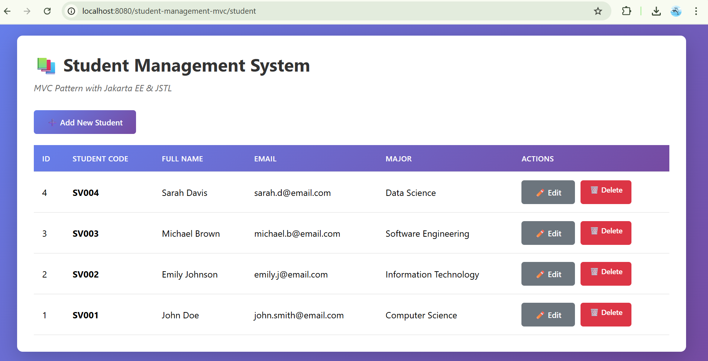
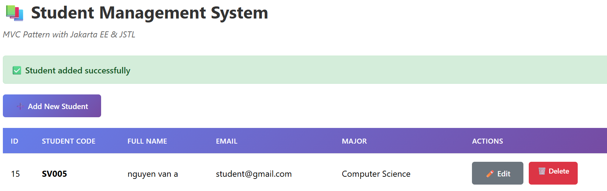
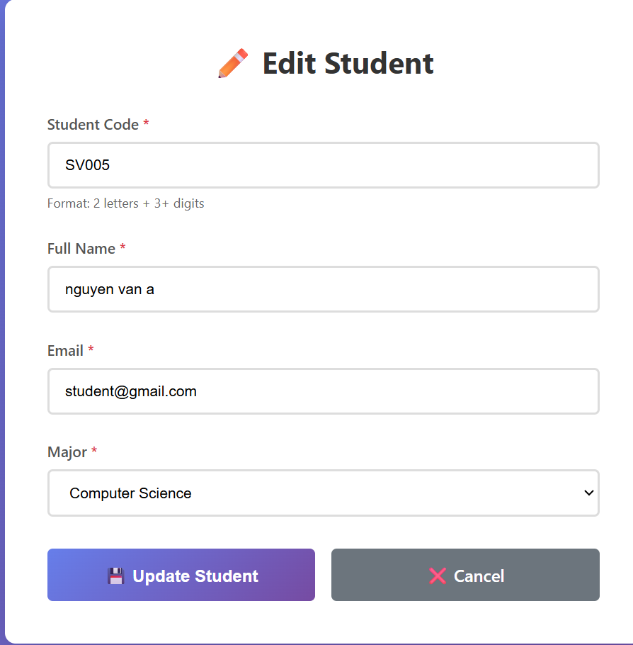
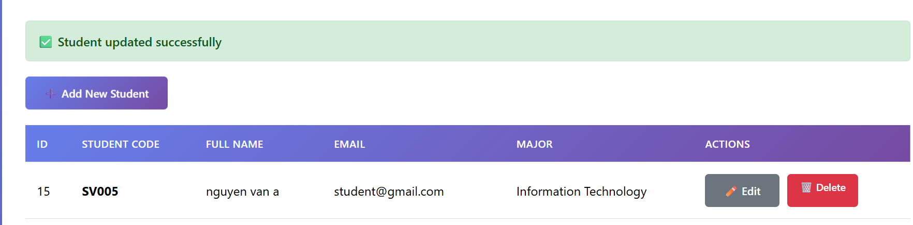
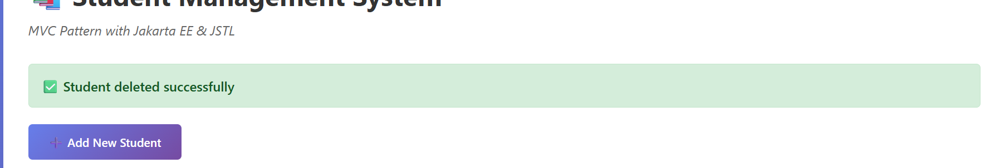

# Student Management MVC (Servlet/JSP) – 

##  Test Case Outputs & Screenshots (Simulated)
Below are simulated output captures representing expected results when executing **List**, **Create**, **Update**, and **Delete** operations.

---

### ✅ 1. LIST STUDENTS –
**URL:** `/student?action=list`





**Expected Behavior:**
- Students are loaded from database via DAO.
- Controller forwards data to `student-list.jsp`.
- JSP renders rows using `<c:forEach>`.

---

###  2. CREATE STUDENT 
**URL (form):** `/student?action=new`


**After Submit → Redirect to List**

List now shows:




**Expected Behavior:**
- `student?action=insert` handles POST request.
- New object → `StudentDAO.addStudent()`.
- On success → redirect `list & message=success`.

---

###  3. UPDATE STUDENT 
**URL (edit):** `/student?action=edit&id=2`

Form is pre-filled:




**After Submit → Redirect to List:**





**Expected Behavior:**
- DAO fetches record: `getStudentById(id)`.
- Fields pre-populate via `${student.fullName}` etc.
- `updateStudent()` updates DB.
- Redirect to refreshed list.

---

###  4. DELETE STUDENT 
**URL:** `/student?action=delete&id=1`

**After action:**




**Expected Behavior:**
- Controller triggers `dao.deleteStudent(id)`.
- DAO executes SQL DELETE.
- Redirect to list.

---

##  CRUD Workflow Explanation (List → Create → Update → Delete)

###  1. LIST Workflow
```
Browser → /student?action=list
      Controller → DAO.getAllStudents()
      Controller → request.setAttribute("students")
      Forward → student-list.jsp
      JSP → Render table via JSTL
```

###  2. CREATE Workflow
```
User → /student?action=new
   Controller → showNewForm()
   JSP → Empty form

User submits form (POST)
   Controller → insertStudent()
   DAO.addStudent()
   Redirect → /student?action=list
```

###  3. UPDATE Workflow
```
User → /student?action=edit&id=X
   Controller → dao.getStudentById(X)
   JSP → Pre-filled form

Form submit → update
   Controller → updateStudent()
   DAO.updateStudent()
   Redirect → list
```

###  4. DELETE Workflow
```
User → /student?action=delete&id=X
   Controller → dao.deleteStudent(X)
   Redirect → /student?action=list
```

Each workflow follows the MVC pattern strictly:
- **M (Model):** Student data object
- **V (View):** JSP pages rendering UI
- **C (Controller):** Routes logic + interacts with DAO
- **DAO:** Database communication layer

---


